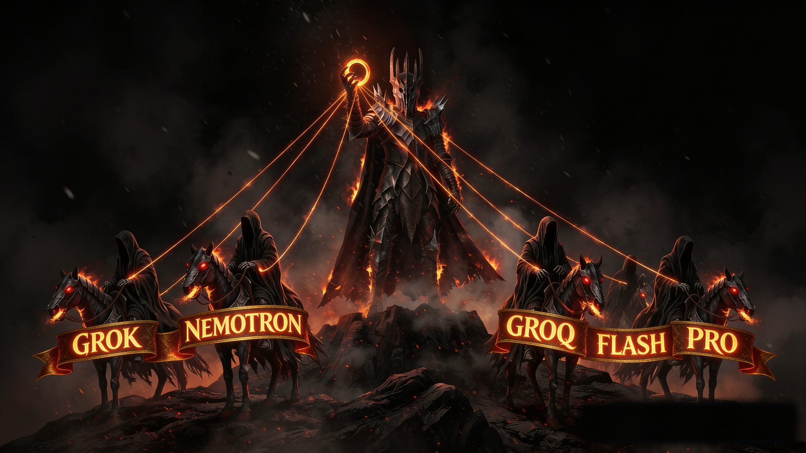

<p align="center">
  
</p>
<p align="center"><sub>diagram view: <a href="sauron.svg">sauron.svg</a> · full resolution: <a href="sauron_full.png">sauron_full.png</a></sub></p>

# sauron

**One agent to route them all.**

> **One model to rule them all, one model to find them, one model to bring them all, and in the darkness bind them.**

---

## What it is

`sauron` is not a standalone binary. It is a set of Claude Code hooks plus supporting documentation that turn Claude Opus into the puppet-master of a multi-model offensive-security workflow. Drop the supplied settings into `~/.claude/settings.json` and the routing logic is baked into Claude, so every prompt is automatically dispatched to the model best suited for the task.

---

## The routing map

- **groq** (gpt-oss-120b, ~500 req/min, 8,000 tokens/min cap): report writing, vulnerability explanations, skeptical validation.
- **nemotron** (NVIDIA Nemotron, 1M context): bulk reading of large artifacts such as JavaScript bundles, logs, and OpenAPI specs. Do NOT use for strict structured extraction (hallucinates).
- **grok-4.1-fast** (x-ai via OpenRouter, 2M context): permissive high-context security reasoning; fallback when Gemini refuses.
- **flash** (Gemini 3.6-flash, 1M context): fast structured extraction. Refuses recon or attack-surface analysis for named targets.
- **or-free** (OpenRouter meta-router, 200K): generalist fallback when no specialised model matches.
- **pro** (Gemini 3 Pro preview): deep reasoning and adversarial debate.

> Even the Eye of Sauron cannot see what it never looks for.

---

## What stays in Claude (never delegated)

- All user-facing decisions.
- Exploitation choices and go/no-go judgments.
- Severity scoring and CVSS calculations.
- Safety-boundary checks.
- Any side-effecting action.
- Orchestration of tool sequences.

Claude remains the final arbiter; the other models only provide auxiliary reasoning.

---

## The 4-step validation pipeline

1. **Validator stress-test.** The `validator` skill challenges the finding for false positives, reproducibility problems, and evidence gaps.
2. **Gap test execution.** Run the tests flagged in step 1 against the target with your own tools.
3. **Adversarial debate.** Invoke `mcp__pal__challenge` with `pro` as the primary debater and `groq` as the fallback, framing severity, exploitability, and chain viability.
4. **Synthesis and reporting.** `groq` drafts the final report. A human sanity-check verifies byte-exact evidence against the raw data before submission.

The pipeline is enforced by the hooks, so it cannot be bypassed inadvertently.

---

## Failover doctrine

If any model refuses, times out, or errors, the request is instantly re-routed to the next suitable model. A refusal is a routing problem, not a stop.

Preferred order for the common tasks:

- Deterministic recon parsing: `jq` and local shell first (token-free, cannot refuse).
- Permissive high-context security reasoning: `grok-4.1-fast`.
- Prose and validation: `groq`.
- Generic fallback: `or-free`.

---

## The hooks

Two hooks live in `~/.claude/settings.json`:

- **SessionStart.** Auto-invokes the `caveman`, `pentesting-agent`, and `validator` skills at the start of every Claude session and instructs the model to read `MEMORY.md` for engagement context.
- **UserPromptSubmit.** Re-asserts the delegate-first plus failover policy on every message, so nothing drifts as sessions grow long.

Files shipped in this repo:

- `settings.example.json`: template you copy into `~/.claude/settings.json`.
- `four-step-validation.md`: detailed walkthrough of the validation pipeline.
- `pal-model-map.md`: per-model capabilities, aliases, rate limits, and known failure modes.

---

## Install (3 steps)

1. Install the PAL MCP server (a fork of zen-mcp-server): https://github.com/BeehiveInnovations/zen-mcp-server. Register it in your Claude Code MCP config.
2. Copy the example settings into your Claude profile:

   ```bash
   cp settings.example.json ~/.claude/settings.json
   ```

   Then edit the file so `GEMINI_API_KEY` (and any other provider keys) come from environment variables. Do not hardcode secrets.
3. Restart Claude Code to load the new hooks.

---

## Real-world lessons

- **Delegate the prose, never the evidence.** A groq draft once mislabeled a production host as "staging" and dropped a WebSocket query string. The human sanity-check caught it before the report left the desk. Every delegated artifact needs a byte-exact review pass.
- **Gemini flash refuses recon or attack-surface analysis for named targets.** Route deterministic parsing to `jq` and local shell. Reserve `grok-4.1-fast` for LLM reasoning over recon output.
- **NVIDIA Nemotron hallucinates on strict structured extraction.** Use it only for bulk reading. Reach for `flash` or `groq` when you need reliable key-value output.
- **Groq's 8,000 TPM cap forces chunking.** Handing it four finding files at once (23,628 tokens) fails outright. Split into per-item calls.

---

## Authorized use only

This setup is intended for authorized penetration-testing and bug-bounty engagements only. Using it against systems you do not own or lack explicit permission to test may violate the law and is prohibited.
