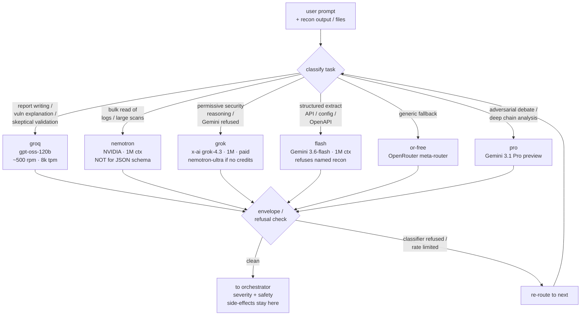
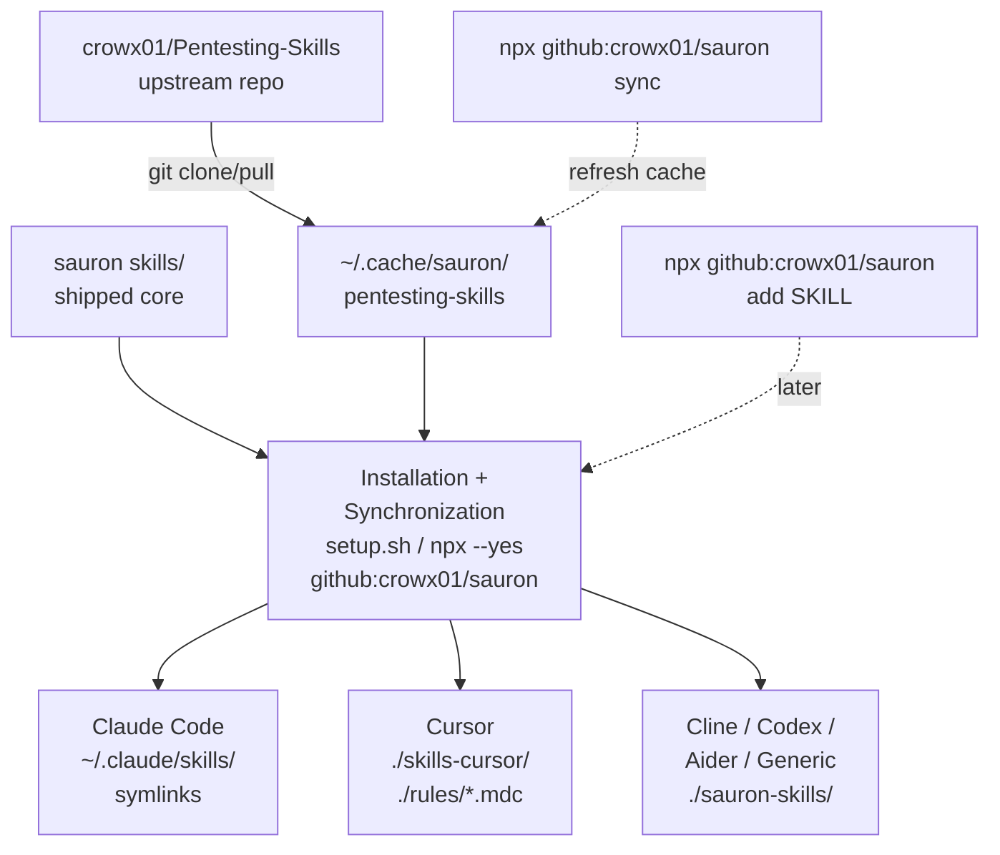

<p align="center">
  
</p>
<p align="center"><sub>diagram view: <a href="sauron.svg">sauron.svg</a> · full resolution: <a href="sauron_full.png">sauron_full.png</a></sub></p>

# sauron

**One agent to route them all.**

> **One model to rule them all, one model to find them, one model to bring them all, and in the darkness bind them.**

## What it is

I built Sauron as a collection of skills that let my AI orchestrator become the puppet-master of a multi-model chain for bug-bounty and offensive-security work. The installer drops the appropriate rules into Claude Code, Cursor, Cline, Codex CLI, Aider, or, for any other orchestrator, writes a portable `SYSTEM_PROMPT.md`. The setup wizard walks you through picking the orchestrator, the install scope, the skills, and the routed models, so the master model calls the helpers while you keep the judgment calls.

## The Nazgul (skills)

| Skill | Job | Source |
|-------|-----|--------|
| [`finding-pipeline`](skills/finding-pipeline/SKILL.md) | Orchestrates the 4-step validation pipeline over a confirmed finding. Not the reviewer: step A calls the `validator` skill from the knowledge base, step C calls PAL, step D calls groq. Renamed from `validator`, which collided with that reviewer. | mine |
| [`pal-router`](skills/pal-router/SKILL.md) | Delegate-first + failover doctrine for dispatching sub-tasks to cheaper or free PAL models. Carries the error-class → model routing table. | mine |
| [`kali-exec`](skills/kali-exec/SKILL.md) | Kali/Linux shell-execution doctrine: absolute paths, no `cd` persistence between tool calls, PEP 668 ladder, capability-first before install. | mine |
| [`recovery`](skills/recovery/SKILL.md) | Failure classification + escalation chain. Replaces blind retry with classify → diagnose → independent recheck → escalate → verify, with bounded budgets. | mine |
| [`debate-review`](skills/debate-review/SKILL.md) | Two-model debate review of a GitHub PR, GitLab MR, or Azure DevOps PR. Posts inline P0/P1/P2 comments from your own gh/glab/az. | adapted from [amElnagdy/review-skills](https://github.com/amElnagdy/review-skills) (MIT) |
| [`babysit-pr`](skills/babysit-pr/SKILL.md) | Works PR review rounds automatically: verifies findings, fixes blockers, replies in-thread, resolves, re-runs. | adapted from [amElnagdy/review-skills](https://github.com/amElnagdy/review-skills) (MIT) |
| [`pal-learn`](skills/pal-learn/SKILL.md) | Files an observed routing fact (refusal, 402, withdrawn model ID, hallucination, working fallback) back into the model map, verified against the live provider first. Keeps the routing knowledge from going stale. | mine, adapting the `pentest-learn` loop from [Pentesting-Agent-new](https://github.com/Darxbloo/Pentesting-Agent-new) |
| `pentesting-agent`, and 40 vulnerability-category skills | The offensive-security knowledge base the generated hook auto-loads: authorization gate, triage decision tree, per-class methodology/tooling/reporting/case-patterns. Plus `agents/pentester.md`, `pentest-learn` and `pentest-debrief`. | **not shipped here** - install from [Pentesting-Agent-new](https://github.com/Darxbloo/Pentesting-Agent-new) |
| `caveman` | Ultra-compressed output that keeps code, commands and evidence byte-exact. Auto-loaded at session start in `full` mode. | **not shipped here** - install from [JuliusBrussee/caveman](https://github.com/JuliusBrussee/caveman) (skills tree MIT; its engine dirs are BSL-1.1) |

See [`docs/RELIABILITY.md`](docs/RELIABILITY.md) for the three-layer scope map (sauron = installer; Claude Code = orchestrator; PAL = runtime) and how a Kali run should flow under the new doctrine. Validate the shipped repo with `./setup.sh selftest` (or `npm test`): bash/python/node syntax, YAML frontmatter, JSON validity, and doctrine coverage, zero network.

## Model routing workflow

Each task class routes to a delegate. Judgment calls (severity, exploitation choice, safety boundaries) stay in the orchestrator.


```mermaid
flowchart TD
    U[user prompt<br/>+ recon output / files] --> R{classify task}
    R -->|report writing /<br/>vuln explanation /<br/>skeptical validation| GRQ[groq<br/>gpt-oss-120b<br/>~500 rpm · 8k tpm]
    R -->|bulk read of<br/>logs / large scans| NEM[nemotron<br/>NVIDIA · 1M ctx<br/>NOT for JSON schema]
    R -->|permissive security<br/>reasoning /<br/>Gemini refused| GRK[grok<br/>x-ai grok-4.3 · 1M · paid<br/>nemotron-ultra if no credits]
    R -->|structured extract<br/>API / config /<br/>OpenAPI| FLS[flash<br/>Gemini 3.6-flash · 1M ctx<br/>refuses named recon]
    R -->|generic fallback| ORF[or-free<br/>OpenRouter meta-router]
    R -->|adversarial debate /<br/>deep chain analysis| PRO[pro<br/>Gemini 3.1 Pro preview]
    GRQ & NEM & GRK & FLS & ORF & PRO --> V{envelope /<br/>refusal check}
    V -->|clean| OUT[to orchestrator<br/>severity + safety<br/>side-effects stay here]
    V -->|classifier refused /<br/>rate limited| RT[re-route to next]
    RT --> R
```

<details><summary>ASCII fallback</summary>

```text
                    user prompt + recon output
                                │
                                ▼
              ┌─────────────────────────────────────┐
              │  classify task                      │
              └─┬────┬────┬────┬────┬────┬──────────┘
                │    │    │    │    │    │
     report/    │ bulk│ permis│ struct│ generic│ adversarial
     vuln       │ read│ security │ extract│ fallback│ debate
     explain/   │ of  │ reasoning│ (API/  │        │ deep chain
     validate   │ logs│ (grok)   │ config)│        │
                ▼    ▼    ▼    ▼    ▼    ▼
              groq  nemo   grok  flash  or-free   pro
              gpt-  NVIDIA x-ai  Gemini  OR meta  Gemini 3
              oss-  1M     1M    3.6-    router   Pro pre
              120b  ctx    ctx   flash   200K     (challenge)
                │    │    │    │    │    │
                └────┴────┴─┬──┴────┴────┘
                            ▼
                envelope / refusal check
                  ├── clean ──▶ orchestrator (severity/safety)
                  └── refused / rate-limited ──▶ re-route
```

</details>

### The `sauron` engine CLI

Installing sauron gives you the `sauron` CLI, which drives the bundled core engine. `sauron serve` starts the engine (the MCP server) for any client; `sauron run "<task>"` is a headless one-shot (`--ro`, `--agent`, `--model`, `--json`); **`sauron run --plan plan.md`** hands a whole job off and returns only the result.

**`sauron chat`** is a self-contained interactive assistant — chat and the tool loop go straight through the engine's router (classifier routing, capability-matched fallback, refusal-memory, credential masking), so it needs no running MCP server. It keeps a **persistent in-session context**: every plain message runs with full tools on the box (**qwen3** on Groq is the default tool executor) and remembers prior turns, so follow-ups build on what came before instead of starting from zero. Commands:

- `/ask | /cheap | /smart <q>` — plain chat (no tools) for one message
- `/agent[:edit|:plan|:review] <task>` — Claude **plans**, engine models **execute** (see below) · `/debate` · `/delegate <model> <q>`
- `/context` · `/history` · `/compact` (summarize older turns) · `/clear` (reset) · `/resume [id|list]` (persists across restarts)
- `/model` · `/models` · `/help` · `/exit`

**Claude plans, the engine executes (token-saving, default).** To keep Claude's
token spend to a minimum, the external Claude orchestrator is used for
**planning only** — `/agent:plan` drafts a plan on Claude, and every execution
role (`/agent`, `/agent:edit`, `/agent:review`) runs on the **smartest available
engine models**, primed with an orchestrator-aware system prompt, never on
Claude. If no Claude CLI is present, planning also falls back to engine models,
so the engine is fully self-dependent. Set `PAL_CLAUDE_PLAN_ONLY=0` to let Claude
execute agent tasks as before. **Huge/high-stakes tasks** are additionally
validated through the `executor→reviewer→judge` debate panel before the answer
is trusted (`PAL_CHAT_AUTODEBATE=0` to disable).

Routing learns from outcomes (`sauron distill`). Details: [pal-router](skills/pal-router/SKILL.md).

Full matrix: [skills/pal-router/model-map.md](skills/pal-router/model-map.md).

## The 4-step validation pipeline

1. Validator stress-test (twelve fields).
2. Gap tests (run the missing checks with your own tools).
3. Adversarial debate via `mcp__pal__challenge` (pro primary, groq fallback).
4. Synthesize + write (delegate prose to groq; human sanity-checks byte-exact against evidence).

Full spec: [skills/finding-pipeline/SKILL.md](skills/finding-pipeline/SKILL.md).

## Orchestrators

The installer supports six targets. Pick one at prompt `0` in `./setup.sh`.

- **Claude Code** (default): writes `~/.claude/settings.json` (or `./.claude/settings.json` for per-project) with `SessionStart` + `UserPromptSubmit` hooks, and symlinks `skills/*` into `~/.claude/skills/`.
- **Cursor**: writes `./.cursor/rules/sauron.mdc` with `alwaysApply: true`, and copies `skills/*` into `./.cursor/rules/sauron-skills/` so the model can read them.
- **Cline**: writes `./.clinerules` (or `~/.clinerules` for global) with the routing doctrine, and copies `skills/*` into `./sauron-skills/`.
- **Codex CLI**: writes `~/.codex/instructions.md` and copies `skills/*` into `~/.codex/sauron-skills/`.
- **Aider**: writes `./.aider.sauron.md` (add to your `.aider.conf.yml` as `read: [./.aider.sauron.md]`) and copies `skills/*` into `./sauron-skills/`.
- **Generic / other**: writes `./SYSTEM_PROMPT.sauron.md` you can paste into any tool's system prompt, with `skills/*` copied alongside.

For non-Claude orchestrators the installer also appends an index of the shipped skills to the rules file so the model knows what SKILL.md files it can read when a trigger phrase appears (since only Claude Code has the `Skill()` primitive).

## Install

```bash
# One-liner (Node available) — pulls the repo, then runs the installer:
npx --yes github:crowx01/sauron

# or clone + run bash
git clone https://github.com/crowx01/sauron && cd sauron
./setup.sh
```

> Not published to npm yet, so use the `github:` shorthand above (or `npm i -g .`
> from a clone if you want a persistent `sauron` binary on `PATH`).

`setup.sh` (and its `npx` wrapper) walks you through orchestrator, scope, which
skills auto-load at session start, and which routed models you have keys for. For
each provider you pick it shows the official console URL, takes the key with
**masked entry** (never echoed, stored `0600`, never committed), and
**validates the key shape** so an obvious typo is caught before you finish — any
provider can be skipped and configured later. Then it
handles the rest automatically: writes rules/settings, backs up existing files
with `.bak.<timestamp>`, installs shipped skills into the right agent-specific
directory, **auto-clones and syncs the [`Pentesting-Skills`](https://github.com/crowx01/Pentesting-Skills)
repository into your agent's skills dir** (see below), and provisions + registers
the **bundled core engine** (shipped in `./core`, no separate download) under
`mcpServers.pal`. The engine ships the smart-router
(self-heal, response-cache, classifier, refusal-memory, health-probe — all
on by default) and an opt-in **agentic toolbelt** (`PAL_TOOLBELT=1`, default
config at `~/.pal/toolbelt.json`) that lets routed models call local
read-only tools — `bash` (limited to a read-only command allowlist),
`read_file`, `gh`, and `web_fetch` — during a turn.

**Ctrl+C safe.** State is checkpointed at `$XDG_STATE_HOME/sauron/install-state`
(default `~/.local/state/sauron/`). If the installer is interrupted, re-running
resumes at the first incomplete step:

```text
Previous installation detected.

✓ Orchestrator selection
✓ Install scope
✓ Skill preload picks
✓ routed-model picks
✓ Rules/settings file
→ Skills installed
○ pentesting-skills synchronised
○ API keys

Resuming installation…
```

Reset the checkpoint any time with `./setup.sh reset`.

Full walkthrough: **[docs/WORKFLOW.md](docs/WORKFLOW.md)**  ·  picture-book
walkthrough: **[docs/install-walkthrough.pdf](docs/install-walkthrough.pdf)** (6 pages).

## Skills

**What Skills are.** A skill is a bundle of instructions the AI orchestrator
loads into a conversation when a matching trigger phrase appears (Claude Code
via the `Skill()` primitive; every other orchestrator by referencing the
skill's `SKILL.md` from a rules file). Each skill lives under
[`skills/<name>/`](skills/) with a single `SKILL.md` in YAML-frontmatter form.

**Two sources.** Sauron ships a small core of orchestration skills
(`validator`, `pal-router`, `debate-review`, `babysit-pr`) that stay in-repo,
and automatically imports the offensive-security playbooks from
[`crowx01/Pentesting-Skills`](https://github.com/crowx01/Pentesting-Skills)
during install. That repo is cached at
`~/.cache/sauron/pentesting-skills/` (override via
`SAURON_PENTESTING_SKILLS_REPO` and `SAURON_PENTESTING_SKILLS_CACHE`).

**Where they go per agent.**

| Agent | Skills destination | Rules destination |
|-------|--------------------|-------------------|
| Claude Code | `~/.claude/skills/` (or `./.claude/skills/` per-project) | `~/.claude/settings.json` |
| Cursor | `./skills-cursor/` | `./rules/sauron.mdc` |
| Cline | `./sauron-skills/` | `./.clinerules` |
| Codex CLI | `~/.codex/sauron-skills/` | `~/.codex/instructions.md` |
| Aider | `./sauron-skills/` | `./.aider.sauron.md` |
| Generic | `./sauron-skills/` | `./SYSTEM_PROMPT.sauron.md` |

**Sauron installation flow (what happens automatically):**

```text
Sauron installation
        │
        ├── Install Sauron rules/settings
        ├── Configure CLAUDE.md doctrine
        ├── Install shipped skills (validator, pal-router, …)
        └── Import & sync pentesting-skills
                    │
                    ▼
             pentesting-skills
             cache: ~/.cache/sauron/pentesting-skills
                    │
                    ├── Claude   (symlink into ~/.claude/skills/)
                    ├── Cursor   (copy into ./skills-cursor/)
                    └── Other    (copy into ./sauron-skills/)
```

**Add a single skill after install.**

```bash
npx --yes github:crowx01/sauron add sqli    # or: ./setup.sh add sqli
npx --yes github:crowx01/sauron list        # shipped + pentesting-skills catalog
npx --yes github:crowx01/sauron sync        # refresh pentesting-skills + re-link
```

`add` first looks in `skills/` (shipped), then falls back to the
pentesting-skills cache, so both sources share the same command.

**Add your own skill.** Drop a `skills/<your-skill>/SKILL.md` and re-run
`./setup.sh sync`. To publish it broadly, upstream a PR to
[`Pentesting-Skills`](https://github.com/crowx01/Pentesting-Skills) instead —
`sync` picks it up on the next run.

**Update / remove.** Shipped skills are symlinked (Claude Code) or rsynced
(other agents). Delete the source and re-run `sync` to remove; pull upstream
and re-run `sync` to update. Local edits to synced copies survive `sync`
unless upstream also modified the same file.

### Skills workflow


```mermaid
flowchart TD
    A[sauron skills/<br/>shipped core] --> C
    B[crowx01/Pentesting-Skills<br/>upstream repo] -->|git clone/pull| B2[~/.cache/sauron/<br/>pentesting-skills]
    B2 --> C[Installation +<br/>Synchronization<br/>setup.sh / npx --yes<br/>github:crowx01/sauron]
    C --> D1[Claude Code<br/>~/.claude/skills/<br/>symlinks]
    C --> D2[Cursor<br/>./skills-cursor/<br/>./rules/*.mdc]
    C --> D3[Cline / Codex /<br/>Aider / Generic<br/>./sauron-skills/]
    E[npx github:crowx01/sauron<br/>add SKILL] -.->|later| C
    F[npx github:crowx01/sauron sync] -.->|refresh cache| B2
```

<details><summary>ASCII fallback (renders where Mermaid is stripped)</summary>

```text
   ┌──────────────────────┐    ┌─────────────────────────────┐
   │ sauron skills/       │    │ crowx01/Pentesting-Skills   │
   │ shipped core         │    │ (upstream)                  │
   └──────────┬───────────┘    └───────────┬─────────────────┘
              │                             │ git clone / pull
              │                             ▼
              │                 ┌─────────────────────────┐
              │                 │ ~/.cache/sauron/        │
              │                 │  pentesting-skills      │
              │                 └───────────┬─────────────┘
              │                             │
              ▼                             ▼
     ┌──────────────────────────────────────────────────┐
     │  Installation + Synchronization                  │
     │  setup.sh / npx --yes github:crowx01/sauron / … │
     └───────┬──────────────┬──────────────┬────────────┘
             │              │              │
             ▼              ▼              ▼
   ┌─────────────┐ ┌────────────────┐ ┌───────────────────────┐
   │ Claude Code │ │ Cursor         │ │ Cline / Codex /       │
   │ ~/.claude/  │ │ ./skills-      │ │ Aider / Generic       │
   │  skills/    │ │  cursor/       │ │ ./sauron-skills/      │
   │ (symlinks)  │ │ ./rules/*.mdc  │ │                       │
   └─────────────┘ └────────────────┘ └───────────────────────┘
```

</details>

> Prefer to skip the wizard? Copy `settings.example.json` to
> `~/.claude/settings.json` and edit it by hand. `setup.sh` is just a
> friendlier way to produce the same file.

Then restart your orchestrator.

## Keeping it true

The routing map is a claim about a moving target: models get withdrawn, free tiers change, refusal
behaviour shifts. Sauron borrows the compounding loop from the pentesting knowledge base rather than
leaving these as static notes:

| Trigger | Skill | What happens |
|---|---|---|
| A model refuses, 402s, 404s, hallucinates, or a fallback saves a route | [`pal-learn`](skills/pal-learn/SKILL.md) | Verifies the behaviour against the live provider, then enriches that model's entry in the map, the failover order, and any doc or hook string that names it |
| Before a finding is reported | [`finding-pipeline`](skills/finding-pipeline/SKILL.md) | Runs the 4-step pipeline: stress-test (via the knowledge base's `validator`), close the evidence gaps, adversarial challenge, synthesize |
| End of an engagement | `pentest-debrief` (knowledge base) | Mines the session for techniques and dead ends and files them |

The rule all three share: verify before filing, deduplicate against what is already written, and
correct a wrong claim rather than stacking a caveat on it.

## Real-world lessons

- Delegate the prose, never the evidence. A groq draft once mislabeled a production host as staging and dropped a WebSocket query string; the byte-exact human check caught it.
- Gemini flash refuses recon or attack-surface analysis for named targets. Route deterministic parsing to `jq` and local shell. Reserve `grok` for LLM reasoning over recon.
- NVIDIA Nemotron hallucinates on strict structured extraction. Use it only for bulk reading.
- Groq's 8,000 TPM cap forces chunking. A 23,628-token single-shot call fails outright.

## Attribution

- `skills/debate-review/` and `skills/babysit-pr/` are adapted from [amElnagdy/review-skills](https://github.com/amElnagdy/review-skills) (MIT, Copyright Ahmed Mohammed). Upstream license is preserved inside each skill directory and in [THIRD_PARTY_LICENSES.md](THIRD_PARTY_LICENSES.md).

## License

MIT for sauron's own code ([LICENSE](LICENSE)). Third-party licenses in [THIRD_PARTY_LICENSES.md](THIRD_PARTY_LICENSES.md).

## Authorized use only

Sauron is provided for authorized penetration-testing and bug-bounty engagements only. Using it against systems you do not own or lack explicit permission to test is illegal.
